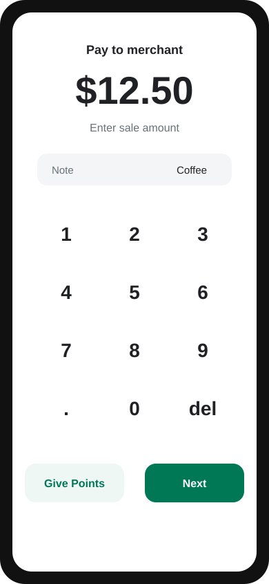
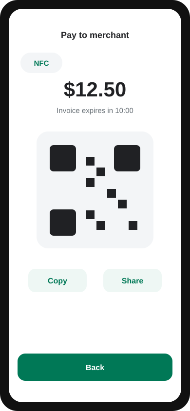
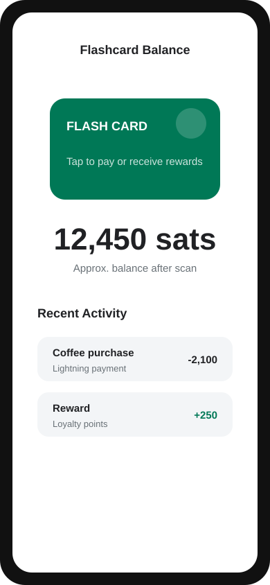

# Flash POS

Flash POS is a React Native point-of-sale app for merchants who accept Bitcoin
and Lightning payments. It combines invoice creation, NFC flashcard support,
customer rewards, transaction history, and receipt printing in one mobile
checkout flow.

## Screenshots

<p align="center">
  
  
  
</p>

## Features

- Create Lightning invoices for customer payments.
- Let customers pay with QR code, copied invoice text, shared invoice text, or
  supported NFC flashcards.
- Award configurable customer rewards for Lightning or external cash/card
  payments.
- View transaction history and flashcard activity.
- Configure reward settings and event-mode promotions behind PIN protection.
- Print receipts through supported mobile receipt-printer integrations.

## Hardware Support

Flash POS can run on Android and iOS devices supported by React Native 0.76.
The optional hardware-dependent flows require:

- An NFC-capable phone or tablet for reading Bolt Card/Flashcard-compatible
  NDEF tags.
- NFC enabled at the operating-system level before scanning customer cards.
- A Bluetooth, network, or platform-supported receipt printer when receipt
  printing is enabled.
- A configured Lightning backend, GraphQL API, and BTCPay Server pull-payment
  setup for production payments and rewards.

NFC and printer behavior should be validated on real devices because most
simulators do not expose the native hardware APIs used by the app.

## Local Development

### Prerequisites

- Node.js 18 or newer.
- Yarn.
- Android Studio and a configured Android SDK for Android development.
- Xcode and CocoaPods for iOS development on macOS.
- A physical device for NFC or printer testing.

### Setup

```bash
git clone https://github.com/lnflash/flash-pos.git
cd flash-pos
yarn install
cp .env.example .env
```

Edit `.env` with your local or staging service endpoints. The most important
values are:

```bash
FLASH_GRAPHQL_URI=https://api.your-server.com/graphql
FLASH_GRAPHQL_WS_URI=wss://api.your-server.com/graphql
FLASH_LN_ADDRESS_URL=https://ln.your-server.com
FLASH_LN_ADDRESS=your-domain.com
BTC_PAY_SERVER=https://btcpay.your-server.com
PULL_PAYMENT_ID=your-btcpay-pull-payment-id
```

See [docs/environment-configuration.md](./docs/environment-configuration.md)
for the full environment reference.

### Run the App

Start Metro:

```bash
yarn start
```

Run Android:

```bash
yarn android
```

Run iOS:

```bash
cd ios
pod install
cd ..
yarn ios
```

### Validate Changes

```bash
yarn test
yarn lint
```

For release smoke checks:

```bash
yarn apk-android
yarn aab-android
```

## Project Structure

```text
flash-pos/
  App.tsx                    Root providers and app shell
  src/routes/                React Navigation stack and tabs
  src/screens/               POS, invoice, rewards, profile, and history screens
  src/components/            Shared UI and feature components
  src/contexts/              Activity and NFC flashcard context providers
  src/graphql/               Apollo client, mutations, subscriptions, queries
  src/store/                 Redux Toolkit slices and persistence
  docs/                      Detailed architecture and feature documentation
  android/                   Android native project
  ios/                       iOS native project
```

## Documentation

- [Project overview](./docs/01-project-overview.md)
- [Development setup](./docs/02-development-setup.md)
- [API integration](./docs/04-api-integration.md)
- [Screens and navigation](./docs/05-screens-navigation.md)
- [NFC integration](./docs/06-nfc-integration.md)
- [Rewards system](./docs/07-rewards-system.md)
- [Printing system](./docs/08-printing-system.md)
- [Testing](./docs/10-testing.md)
- [Deployment](./docs/11-deployment.md)
- [Security](./docs/12-security.md)

## Contributor Quick Start

1. Pick an open issue or create one before starting larger work.
2. Create a branch from `main` and keep your change focused.
3. Update related docs and run `yarn test` plus `yarn lint` before opening a
   pull request.

See [CONTRIBUTING.md](./CONTRIBUTING.md) for the full workflow.

## License

No repository license file is currently included. Confirm licensing with the
maintainers before redistributing or publishing derived builds.
