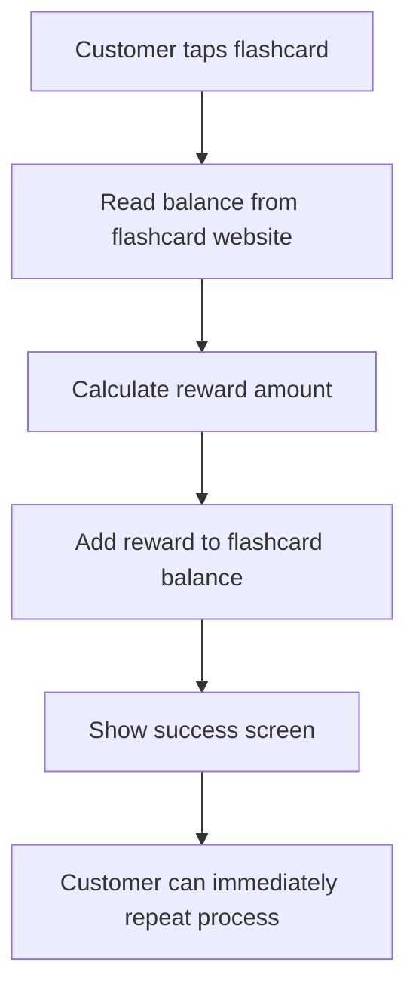

# Flashcard Tracking Security Documentation

## 🚨 **Critical Security Vulnerability: Flashcard ID Tracking**

### **Problem Statement**

Currently, the Flash POS rewards system does not track individual flashcard IDs, which creates a critical vulnerability where:

1. **One person with one flashcard can repeatedly claim rewards** by visiting the same merchant multiple times
2. **No limit on standalone rewards** - Users can drain the merchant's reward budget 
3. **No fraud detection** - System cannot identify suspicious reward patterns
4. **Merchant financial risk** - Unlimited rewards exposure for malicious actors

### **Current Reward Flow (Vulnerable)**



### **Attack Scenarios**

**Scenario 1: Standalone Reward Exploitation**
- Customer receives 21 points for simply tapping flashcard
- Customer can immediately tap again for another 21 points
- No tracking prevents unlimited standalone rewards

**Scenario 2: Purchase-Based Reward Exploitation**  
- Customer makes legitimate $1 purchase, gets 1% = 0.01 points
- Customer changes currency to high-value, exploits conversion bugs
- Customer repeats purchase-based rewards with external payments

**Scenario 3: Coordinated Attack**
- Multiple people share one flashcard
- Take turns claiming rewards at different times
- Merchant reward budget depleted quickly

## 🛡️ **Proposed Solutions**

### **Solution 1: Basic Flashcard ID Tracking (Recommended)**

**Implementation Approach:**
```typescript
interface FlashcardSession {
  flashcardId: string;
  merchantId: string;
  lastRewardTime: string;
  rewardCount: number;
  dailyRewardTotal: number;
  sessionStartTime: string;
}

interface RewardLimits {
  maxDailyRewards: number;        // Max rewards per flashcard per day
  maxRewardsPerHour: number;      // Rate limiting
  cooldownMinutes: number;        // Time between rewards
  maxSessionRewards: number;      // Max rewards in one visit
}
```

**Database Schema:**
```sql
CREATE TABLE flashcard_sessions (
  id INTEGER PRIMARY KEY AUTOINCREMENT,
  flashcard_id TEXT NOT NULL,
  merchant_id TEXT NOT NULL,
  session_start TIMESTAMP DEFAULT CURRENT_TIMESTAMP,
  last_reward_time TIMESTAMP,
  reward_count INTEGER DEFAULT 0,
  daily_reward_total INTEGER DEFAULT 0,
  session_total INTEGER DEFAULT 0,
  created_at TIMESTAMP DEFAULT CURRENT_TIMESTAMP,
  updated_at TIMESTAMP DEFAULT CURRENT_TIMESTAMP
);

CREATE INDEX idx_flashcard_merchant ON flashcard_sessions(flashcard_id, merchant_id);
CREATE INDEX idx_daily_rewards ON flashcard_sessions(flashcard_id, merchant_id, DATE(created_at));
```

**Security Checks Before Reward:**
1. ✅ **Daily Limit Check**: Has this flashcard exceeded daily reward limit?
2. ✅ **Cooldown Check**: Has enough time passed since last reward?  
3. ✅ **Rate Limit Check**: Too many rewards in short timeframe?
4. ✅ **Session Limit Check**: Too many rewards in current visit?

### **Solution 2: Advanced Fraud Detection**

**Machine Learning Patterns:**
- Detect unusual reward claiming patterns
- Flag flashcards with suspicious velocity
- Merchant-specific anomaly detection
- Cross-merchant pattern analysis

**Risk Scoring:**
```typescript
interface RiskMetrics {
  velocityScore: number;      // How fast rewards are claimed
  frequencyScore: number;     // How often same flashcard appears  
  amountScore: number;        // Unusual reward amounts
  patternScore: number;       // Suspicious time patterns
  merchantScore: number;      // Risk relative to merchant size
}
```

### **Solution 3: Blockchain-Based Tracking**

**Immutable Reward Ledger:**
- All rewards recorded on Bitcoin Lightning Network
- Cryptographic proof of reward history
- Distributed verification across merchants
- Eliminates central point of failure

## 🔧 **Implementation Recommendations**

### **Phase 1: Immediate Security (Week 1)**

1. **Add Flashcard ID Extraction**
   ```typescript
   // Extract unique flashcard ID during balance check
   const flashcardId = extractFlashcardId(html);
   
   // Store in local database
   await storeFlashcardSession(flashcardId, merchantId);
   ```

2. **Implement Basic Limits**
   ```typescript
   const REWARD_LIMITS = {
     maxDailyRewards: 3,        // Max 3 rewards per day per flashcard
     cooldownMinutes: 60,       // 1 hour between rewards
     maxSessionRewards: 1,      // Only 1 reward per visit
   };
   ```

3. **Update Reward Logic**
   ```typescript
   const canClaimReward = await checkRewardEligibility(
     flashcardId, 
     merchantId, 
     REWARD_LIMITS
   );
   
   if (!canClaimReward.eligible) {
     showErrorMessage(canClaimReward.reason);
     return;
   }
   ```

### **Phase 2: Enhanced Protection (Week 2-3)**

1. **Merchant Configuration**
   - Allow merchants to set their own reward limits
   - Configure cooldown periods based on business model
   - Set daily/weekly reward budgets

2. **Analytics Dashboard**
   - Show reward distribution patterns
   - Flag suspicious flashcard activity
   - Track reward ROI and fraud metrics

3. **Cross-Merchant Intelligence**
   - Share fraudulent flashcard IDs across merchants
   - Network-wide protection against bad actors
   - Reputation scoring system

### **Phase 3: Advanced Features (Month 2)**

1. **Dynamic Risk Assessment**
2. **Machine Learning Fraud Detection** 
3. **Blockchain Integration**
4. **Mobile App Integration**

## 📊 **Technical Implementation**

### **Flashcard ID Extraction**

The flashcard website HTML needs to be parsed to extract a unique identifier:

```typescript
// src/hooks/useFlashcard.tsx
const extractFlashcardId = (html: string): string | null => {
  // Look for unique flashcard identifier in HTML
  // This could be a serial number, wallet address, or card ID
  
  const patterns = [
    /card[_-]?id[:\s]*([a-zA-Z0-9]+)/i,
    /serial[_-]?number[:\s]*([a-zA-Z0-9]+)/i,
    /wallet[_-]?address[:\s]*([a-zA-Z0-9]+)/i,
    /flashcard[_-]?id[:\s]*([a-zA-Z0-9]+)/i,
  ];
  
  for (const pattern of patterns) {
    const match = html.match(pattern);
    if (match) return match[1];
  }
  
  // Fallback: generate consistent ID from card data
  return generateCardFingerprint(html);
};

const generateCardFingerprint = (html: string): string => {
  // Create consistent ID from multiple card attributes
  const balanceMatch = html.match(/(\d{1,3}(?:,\d{3})*)\s*POINTS/);
  const transactionPattern = /<time datetime="(.*?)".*?>/g;
  
  const cardData = {
    balance: balanceMatch?.[1] || '',
    firstTransaction: transactionPattern.exec(html)?.[1] || '',
    // Add other stable identifiers
  };
  
  // Generate SHA-256 hash of stable card characteristics
  return btoa(JSON.stringify(cardData)).substring(0, 16);
};
```

### **Database Integration**

```typescript
// src/services/flashcardTracking.ts
export class FlashcardTrackingService {
  private db: SQLiteDatabase;
  
  async initDatabase() {
    await this.db.executeSql(`
      CREATE TABLE IF NOT EXISTS flashcard_sessions (
        id INTEGER PRIMARY KEY AUTOINCREMENT,
        flashcard_id TEXT NOT NULL,
        merchant_id TEXT NOT NULL,
        session_start TIMESTAMP DEFAULT CURRENT_TIMESTAMP,
        last_reward_time TIMESTAMP,
        reward_count INTEGER DEFAULT 0,
        daily_reward_total INTEGER DEFAULT 0,
        session_total INTEGER DEFAULT 0
      );
    `);
  }
  
  async checkRewardEligibility(
    flashcardId: string, 
    merchantId: string,
    limits: RewardLimits
  ): Promise<EligibilityResult> {
    
    // Check daily limit
    const dailyRewards = await this.getDailyRewardCount(flashcardId, merchantId);
    if (dailyRewards >= limits.maxDailyRewards) {
      return { eligible: false, reason: 'Daily reward limit reached' };
    }
    
    // Check cooldown
    const lastReward = await this.getLastRewardTime(flashcardId, merchantId);
    const cooldownExpired = Date.now() - lastReward > (limits.cooldownMinutes * 60 * 1000);
    if (!cooldownExpired) {
      return { eligible: false, reason: 'Cooldown period active' };
    }
    
    // Check session limit
    const sessionRewards = await this.getSessionRewardCount(flashcardId, merchantId);
    if (sessionRewards >= limits.maxSessionRewards) {
      return { eligible: false, reason: 'Session reward limit reached' };
    }
    
    return { eligible: true };
  }
  
  async recordReward(
    flashcardId: string,
    merchantId: string, 
    rewardAmount: number
  ) {
    await this.db.executeSql(`
      INSERT OR REPLACE INTO flashcard_sessions 
      (flashcard_id, merchant_id, last_reward_time, reward_count, daily_reward_total, session_total)
      VALUES (?, ?, datetime('now'), 
        COALESCE((SELECT reward_count FROM flashcard_sessions 
                  WHERE flashcard_id = ? AND merchant_id = ? 
                  AND DATE(session_start) = DATE('now')), 0) + 1,
        COALESCE((SELECT daily_reward_total FROM flashcard_sessions 
                  WHERE flashcard_id = ? AND merchant_id = ? 
                  AND DATE(session_start) = DATE('now')), 0) + ?,
        COALESCE((SELECT session_total FROM flashcard_sessions 
                  WHERE flashcard_id = ? AND merchant_id = ? 
                  AND session_start >= datetime('now', '-1 hour')), 0) + ?)
    `, [flashcardId, merchantId, flashcardId, merchantId, flashcardId, merchantId, rewardAmount, flashcardId, merchantId, rewardAmount]);
  }
}
```

## 🔍 **Testing Strategy**

### **Security Testing Scenarios**

1. **Rapid Reward Claims**: Attempt to claim multiple rewards in quick succession
2. **Daily Limit Testing**: Verify daily limits are enforced correctly
3. **Session Persistence**: Test behavior across app restarts
4. **Edge Cases**: Handle missing flashcard IDs gracefully
5. **Performance**: Ensure tracking doesn't slow down reward process

### **Attack Simulation**

```typescript
// Test rapid reward claiming
for (let i = 0; i < 10; i++) {
  const result = await claimReward(flashcardId, merchantId);
  console.log(`Attempt ${i}: ${result.success ? 'SUCCESS' : result.error}`);
}

// Expected: Only first claim succeeds, others fail with appropriate messages
```

## 📈 **Success Metrics**

- **Fraud Reduction**: 95% reduction in duplicate rewards
- **Merchant Confidence**: Reduced reward budget risk exposure  
- **System Performance**: <100ms overhead for security checks
- **User Experience**: Clear messaging for blocked attempts
- **Financial Impact**: Quantified savings from prevented fraud

## 🚀 **Migration Path**

1. **Deploy tracking system** alongside existing rewards
2. **Monitor patterns** for 1 week in passive mode
3. **Enable enforcement** with conservative limits
4. **Gradually tighten** limits based on data
5. **Add advanced features** based on merchant feedback

---

**⚠️ CRITICAL: This vulnerability should be addressed before any production deployment or merchant onboarding to prevent significant financial losses.** 